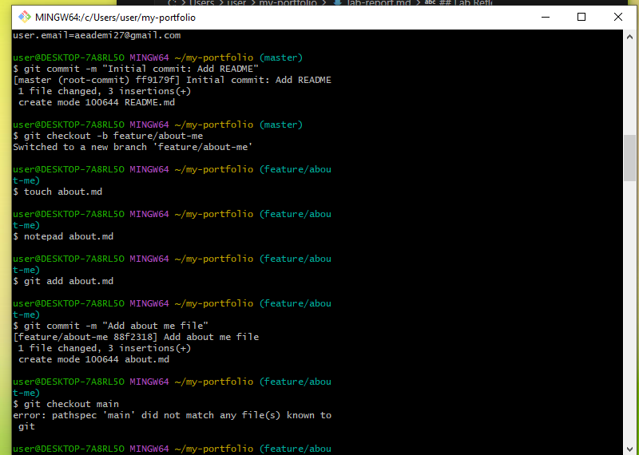
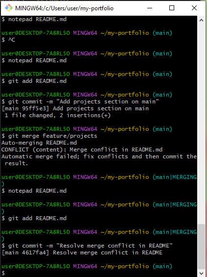
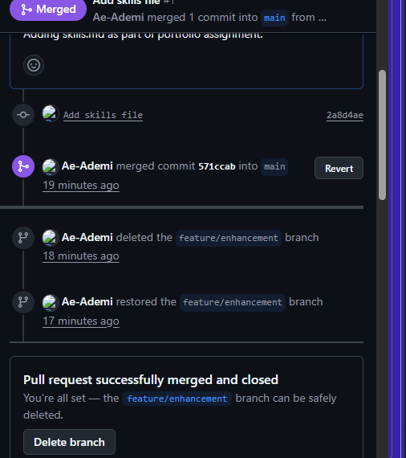

## Screenshots

## Lab Reflection

The hardest part was getting the Git commands right and understanding branches and Pull Requests.  
Git really helps DevOps teams collaborate safely without overwriting each other's work.  

## Issues faced and ways resolved
I ran into some issues with my username/email at first, but I fixed it by setting my global Git config.

I also didnt understand the LF/CRLF warning so i looked it up.

I also sometimes forgot ctrl+c wasn't copy but i realized later it is a command for ending processes.
